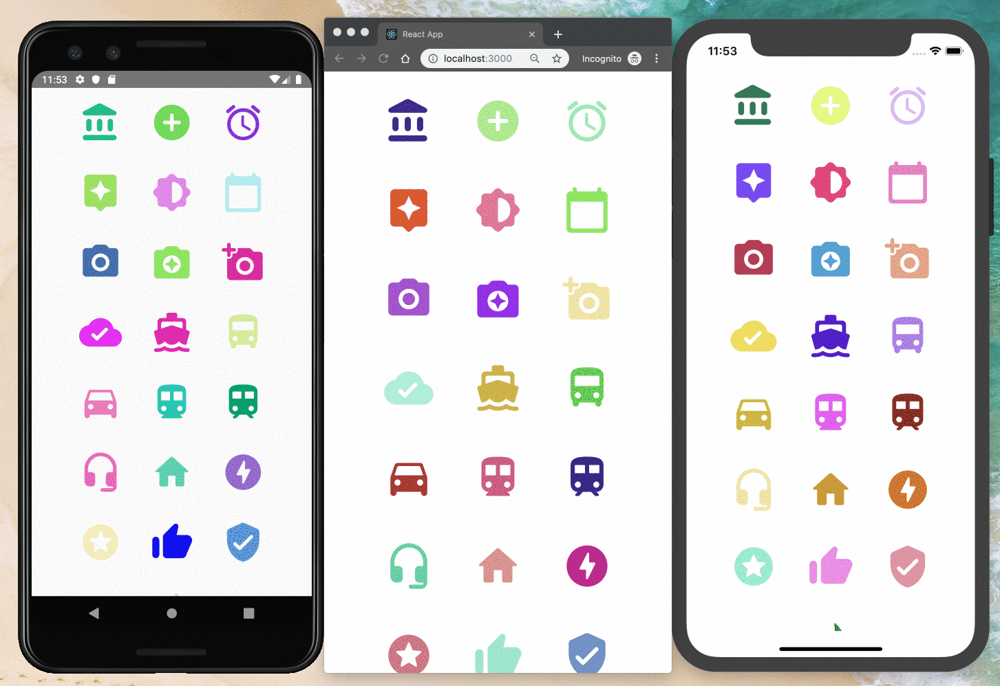

\# maintainable-icon-system-react

> Demo Repository to setup an icon system that can be easily maintainable between React and React Native

This repository serves as example of this article: [Building a Maintainable Icon System in React and React Native][article-link]

## Demo

### [Live Web Demo ⚛️][demo-link]



Collection of icons used: [Material Design](https://material.io/resources/icons/?style=baseline).

## Setup the project

In case you want to run the Android or iOS project you need to first setup the environment for both:

- [iOS Setup](https://facebook.github.io/react-native/docs/getting-started#installing-dependencies)
- [Android Setup](https://facebook.github.io/react-native/docs/getting-started#installing-dependencies-1)

```bash
> git clone https://github.com/EmaSuriano/maintainable-icon-system-react.git
> cd maintainable-icon-system-react
> yarn
```

## Commands

- `start-web`: Run the web project using React in the browser.
- `build-web`: Build the web project using React for the browser.
- `start-ios`: Run the iOS project using React Native in the emulator.
- `start-android`: Run the Android project using React Native in the emulator.
- `generate-icon`: Generate the Icon Components given the icons inside the assets folder.
- `lint`: Run `eslint` with the `create-react-app` config.

## Dependencies

- `react`: UI component library.
- `react-dom`: to render in the browser.
- `react-native`: UI mobile library.
- `styled-components`: to style both web and native components.
- `react-scripts`: provides the `start` command.
- `icon-font-generator`: generate a font from the `svg` icons.
- `randomcolor`: generate fancy colors for the icons 🦄.
- `eslint`: linter for the whole project. The configuration is the default from `create-react-app`.

## License

MIT.

[article-link]: https://emasuriano.com/blog/building-a-maintainable-icon-system-for-react-and-react-native
[demo-link]: https://emasuriano.github.io/maintainable-icon-system-react/index.html
